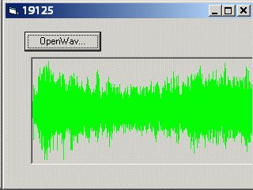



## AnnaCarin

### Description

Reading and displaying 16, 24 and 32bit WaveAudio-formats. The 24-bit format is especially tricky.
 
### More Info
 
Input any wavefile.

Displaying the waveform in a picBox.

Ugly grapgics. This is just made to show you the math.

             |
---                |---
**Submitted On**   |2006-11-25 23:04:06
**By**             |[AnnaCarin](https://github.com/Planet-Source-Code/PSCIndex/blob/master/ByAuthor/annacarin.md)
**Level**          |Advanced
**User Rating**    |5.0 (20 globes from 4 users)
**Compatibility**  |VB 6\.0
**Category**       |[Sound/MP3](https://github.com/Planet-Source-Code/PSCIndex/blob/master/ByCategory/sound-mp3__1-45.md)
**World**          |[Visual Basic](https://github.com/Planet-Source-Code/PSCIndex/blob/master/ByWorld/visual-basic.md)
**Archive File**   |[AnnaCarin2055403222007\.zip](https://github.com/Planet-Source-Code/annacarin-annacarin__1-68179/archive/master.zip)

